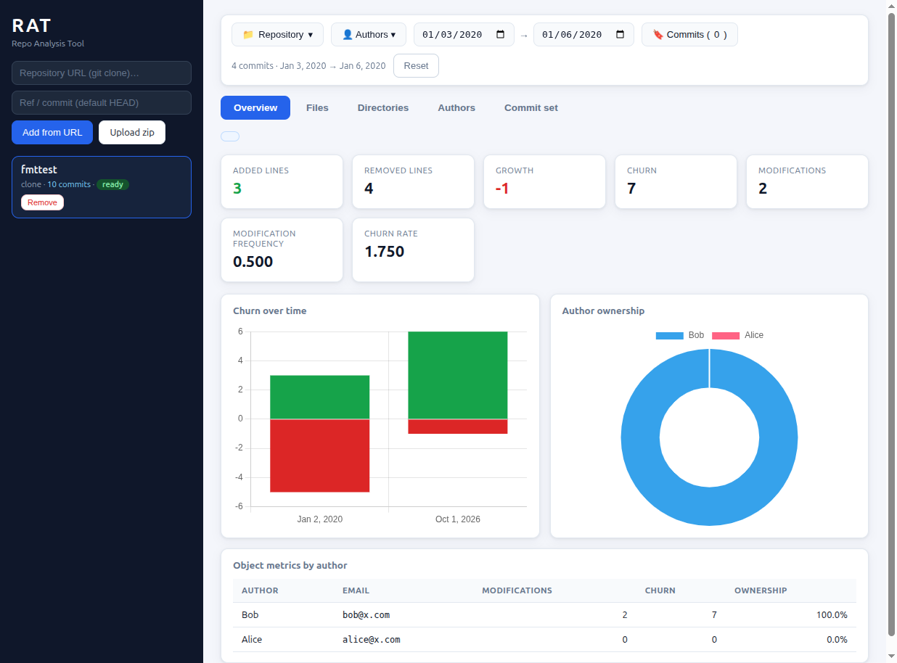

# Repo Analysis Tool (RAT)

A web dashboard that ingests Git repositories and computes the metrics
defined in the COMS3011A test brief: **added**, **removed**, **growth**,
**churn**, **modifications**, **modification frequency**, **churn rate** and
**ownership** — per **file**, **directory**, **repository**, **commit set**
and **author**, with rich filtering.



## Quickstart

Requirements: Python 3.10+ and `git` on the PATH. No database server needed —
SQLite is embedded.

```bash
pip install -r requirements.txt
./run.sh            # serves http://127.0.0.1:8000
```

The database is created automatically at `data/rat.db`.

## Features

- **Ingestion** — add repositories by remote URL (deep clone) or by
  uploading a `.zip` of a repository (the archive must contain `.git`).
  Ingestion runs in the background with live progress; large repositories
  stay responsive because all metrics are precomputed at ingest time.
  Jobs are durable: unfinished ingests resume automatically after a server
  restart, failed repos offer a Retry button, and deleting a repo cancels a
  running ingest cleanly.
- **Object metrics** — click any file or directory in the path tree (or the
  repository itself) to see added / removed / growth / churn / modifications
  / frequency / churn rate, an ownership doughnut and per-author breakdown.
- **Commit-set filtering** — restrict the commit set H̄ by:
  - committer-date window `[from, to)` (date pickers),
  - a manual selection of individual commits (commits tab, full or short
    hashes),
  - one or more authors (author filter panel),
  - any combination of the above (all ANDed).
- **Leaderboards** — top files and top directories by churn, with sortable
  columns and per-row ownership bars.
- **Author merge** — combine author identities either through the repo's
  `.mailmap` (applied automatically during extraction via
  `git log --use-mailmap`) or manually by selecting authors and merging them
  in the Authors tab.
- **Charts** — stacked added/removed time series and ownership doughnut,
  rendered with a vendored copy of Chart.js (no CDN dependency).

## Metric semantics

Extraction replays `git log --no-merges -M50% --use-mailmap --numstat` for
the non-merge commits reachable from the selected ref (H̄, default `HEAD`):

- renames detected at ≥ 50% similarity attribute their line counts to the
  new path; below the threshold a rename appears as delete + add,
- binary files (`-\t-\t` numstat entries) are excluded from all metrics,
- deleted files still accumulate removed lines on their path,
- directory metrics are the recursive sums of all files beneath them
  (precomputed into `dir_stats` during ingestion),
- `growth = added − removed`, `churn λ = added + removed`,
- `modifications n = |{h ∈ H : λ_h,o > 0}|`, `frequency = n/|H|`,
  `churn rate = λ/|H|`, `ownership = λ_author / λ_total`.

## Architecture

```
backend/
  main.py       FastAPI app + static frontend serving
  api.py        REST routes (/api/repos, /metrics, /leaders, /authors, ...)
  db.py         SQLite schema (WAL), connection helpers
  ingest.py     zip upload / clone + worker logic, friendly ref/empty-repo errors
  extract.py    git log --numstat streaming parser → DB
  metrics.py    set-restricted metric SQL (object/leaders/authors/timeseries)
  jobs.py       durable background jobs: threads, recovery, cancellation
  progress.py   in-memory progress registry for background jobs
frontend/
  index.html, style.css, app.js     vanilla JS dashboard (no framework)
  vendor/chart.umd.min.js           vendored Chart.js
tests/
  make_synthetic_repo.py            oracle test (see below)
```

Ingestion clones into `data/repos/<id>/` and streams `git log` output into
SQLite with batched inserts. Every query the dashboard makes is a plain SQL
query over the precomputed `file_stats` / `dir_stats` tables joined to
`commits`, so response times stay in the tens of milliseconds even on
repositories with 10k+ commits.

## Testing

`tests/make_synthetic_repo.py` builds a deterministic 9-commit repository
(adds, edits, pure rename, rename+edit above/below the −M50% threshold,
binary files, deletions, `.mailmap`, time-window and manual-set filtering
including short-hash prefixes, manual author merge, empty-repo and
failed-clone error handling, retry) and asserts the API output against
hand-computed oracle values — **58 checks**, all expected to pass:

```bash
./run.sh &                                   # server must be running
python3 tests/make_synthetic_repo.py         # 58/58 checks passed
```

The metrics have also been validated against real repositories: whole-repo
totals match raw `git log --numstat` aggregation exactly for **cJSON**
(≈1k commits) and **Redis** (≈12k commits, ingested in ~25 s, dashboard
queries 8–24 ms).

## AI declaration

This project was developed with AI coding assistance (Qoder) used for
design discussion, implementation and debugging. The requirements analysis,
metric definitions, verification strategy and oracle values were
deliberately checked by hand against the test brief and raw `git`
output.
